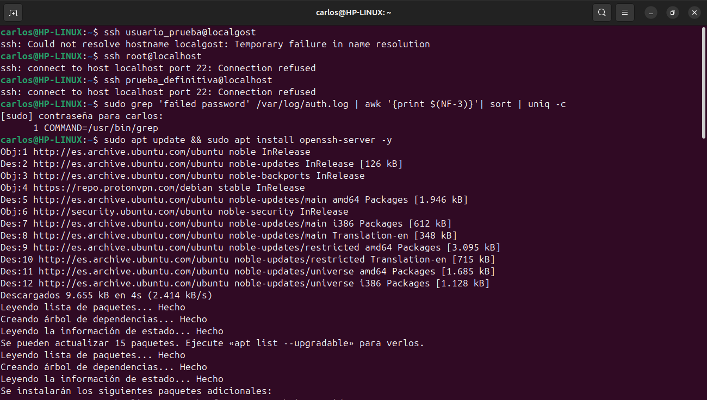
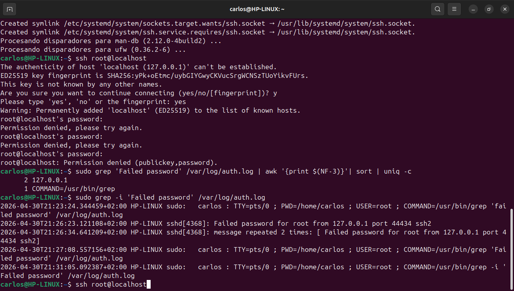

# 🛡️ Laboratorio: Análisis Forense de Logs (SSH)

## Descripción
Este proyecto demuestra la capacidad de identificar y analizar intentos de acceso no autorizados en un servidor Linux (HP 630) mediante la auditoría del archivo de logs del sistema. Esta práctica forma parte de mi preparación para la certificación **CompTIA Security+**.

## 🛠️ Entorno de Trabajo
- **Sistema Operativo:** Ubuntu Linux (Nativo en HP 630)
- **Servicio Analizado:** OpenSSH Server
- **Archivo de Log:** `/var/log/auth.log`

## 🔍 Metodología de Investigación
Para identificar el ataque de fuerza bruta, se utilizó una "tubería" (pipeline) de comandos en la terminal para filtrar, procesar y contabilizar la evidencia:
```bash
sudo grep 'Failed password' /var/log/auth.log | awk '{print $(NF-3)}' | sort | uniq -c
'''
## 🛡️ Recomendaciones de Seguridad (Hardening)
Tras el análisis, se recomiendan las siguientes medidas para mitigar ataques de fuerza bruta:
1. **Deshabilitar el acceso root**: Modificar `PermitRootLogin no` en `/etc/ssh/sshd_config`.
2. **Cambiar el puerto por defecto**: Mover el servicio del puerto 22 a uno menos común.
3. **Implementar Fail2Ban**: Automatizar el bloqueo de IPs tras X intentos fallidos.
4. **Uso de llaves SSH (PKI)**: Deshabilitar completamente la autenticación por contraseña.

## 📊 Evidencia del Laboratorio



